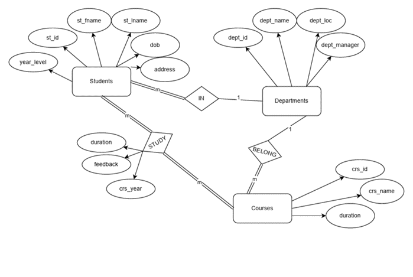

# University System Documentation

*Prepared by Ahmed Jumaa | Feb. 2024*

## Table of Contents
1. [Introduction](#introduction)
2. [Database Design](#database-design)
   1. [Tables](#tables)
   2. [Normalization](#normalization)
3. [SQL Implementation](#sql-implementation)
   1. [Create Tables](#create-tables)
   2. [Insert Data](#insert-data)
4. [PL/SQL](#plsql)
   1. [Creating Functions & Procedures](#creating-functions--procedures)
   2. [Creating Seq-trigger Pairs](#creating-seq-trigger-pairs)
5. [Automation Script (BASH)](#automation-script-bash)
6. [Java Application](#java-application)
   1. [Explore Scenes](#explore-scenes)
   2. [Explore Code](#explore-code)
7. [Data Access Layer](#data-access-layer)

## Introduction

This comprehensive documentation outlines the design, implementation, and functionality of a University System, covering key aspects such as database design, SQL implementation, PL/SQL procedures, an automation script, and a Java application. Each section is meticulously detailed to provide a clear understanding of the system's architecture, facilitating ease of development, maintenance, and troubleshooting.

## Database Design

This document has provided a comprehensive overview of the relational database schema for managing student, course, department, and grade information. The design adheres to normalization principles to ensure data integrity. The outlined schema will serve as a foundation for subsequent steps, including SQL script creation, data population, and the development of PL/SQL procedures and Java applications.

### Tables

- **Students Table**
  - `st_id`: Unique identifier for each student.
  - `st_fname`: First name of the student.
  - `st_lname`: Last name of the student.
  - `dob`: Date of birth of the student.
  - `address`: Address of the student.
  - `year_level`: Current academic year of the student.
  - `dept_id`: Foreign key referencing the Departments table.

- **Departments Table**
  - `dept_id`: Unique identifier for each department.
  - `dept_name`: Name of the department.
  - `dept_loc`: Location of the department.
  - `dept_manager`: Manager of the department.

- **Courses Table**
  - `crs_id`: Unique identifier for each course.
  - `crs_name`: Name of the course.
  - `credits`: Credits associated with the course.

- **Grades Table**
  - `g_id`: Unique identifier for each grade entry.
  - `st_id`: Foreign key referencing the Students table.
  - `crs_id`: Foreign key referencing the Courses table.
  - `grade`: Grade obtained by the student.
  - `feedback`: Feedback related to the student's performance.
  - `crs_year`: Academic year in which the course was taken.

## SQL Implementation

The code for creating the database schema is in a file named `metadata.sql`. This SQL script is designed to create tables for a university-related database, specifically focusing on students, departments, courses, and grades.

### Create Tables

...

### Insert Data

...

## PL/SQL

Creating some functions and procedures to help organize code by grouping related tasks together. This enhances code readability and makes it easier to maintain and troubleshoot.

### Creating Functions & Procedures

#### `calculate_gpa` PL/SQL Function

...

#### `update_all_gpa` PL/SQL Procedure

...

#### `getBestGpa` PL/SQL Function

...

### Creating Seq-trigger Pairs

- **Sequence: ITI.GRADES_SEQ**
  - The sequence `ITI.GRADES_SEQ` is designed to generate unique values for the primary key column `G_ID` in the `ITI.GRADES` table.
    - Start Value: The sequence starts with the value 131.
    - Maximum Value: The maximum value is set to a very high number to accommodate a large number of unique values.
    - Minimum Value: The minimum value is set to 1.
    - No Cycle: The sequence does not cycle back to its start value.
    - Cache: The sequence preallocates and caches 10 values for better performance.
    - No Order: The sequence may not generate values in order of request.

- **Trigger: ITI.GRADES_TRG**
  - The trigger `ITI.GRADES_TRG` is associated with the BEFORE INSERT event on the `ITI.GRADES` table. Its purpose is to automatically populate the `G_ID` column with the next value from the `ITI.GRADES_SEQ` sequence.
    - Event: The trigger is fired before an INSERT operation on the `ITI.GRADES` table.
    - Referencing Clause: The `REFERENCING` clause is used to reference the new and old values of the rows being affected.
    - Trigger Body: In the trigger body, the `:new.G_ID` is assigned the next value from the `ITI.GRADES_SEQ` sequence.

## Automation Script (BASH)

- **DISK MONITORING - `backup.sh`**
  - Bash Script to monitor the Hard Disk usage and send alerts in case a specific threshold is exceeded. The `log.log` file contains the disk monitoring and the backup logs.

- **DATABASE BACKUP - `backup.sh`**
  - Perform a full backup of the database. The `script.bat` file is used by Windows task scheduler to run the bash script.

## Java Application

In this project, I provided the Java Source Code in the `Java` folder. This folder contains the source code for the Java application, enabling you to use any code editor for building and running the application.

- **Client:** Contains classes shared across applications (DTOs).
- **Database:** Houses the Singleton class managing the Database Connection.
- **GUI:** Encompasses code for all front-end (GUI) classes, including the source code for the application's backend.
- **Images:** Stores assets (pictures) used by the application.

### Explore Scenes

1. **Report & Homepage:**
   - This section provides comprehensive information and analysis concerning students, courses, departments, and student GPAs within the application.

2. **Search Students:**
   - This scene offers detailed information on specific students, allowing users to view their complete profiles. Additionally, users can seamlessly enroll students in courses and grade those courses, all within the same interactive interface.

3. **All Students:**
   - This scene serves as a central hub for accessing information on all students. Users can not only view existing data but also conveniently insert new students directly within the same interface. Additionally, it features the "Update Students GPA" function, seamlessly connecting with a database procedure for maintaining accurate student records.

4. **Departments:**
   - This scene provides a comprehensive display of departmental data, offering insights into various aspects related to each department within the application.

5. **Courses:**
   - Within this scene, you can explore detailed information about courses, including relevant course data and the average grade associated with each course. This feature provides a quick overview of the performance metrics for individual courses within the application.

## Data Access Layer

Having explored the Scenes in detail, let's now delve into the implementation by providing code snippets from the Data access layer. This will facilitate a deeper understanding of the integration between the scene and the underlying data functionality.
